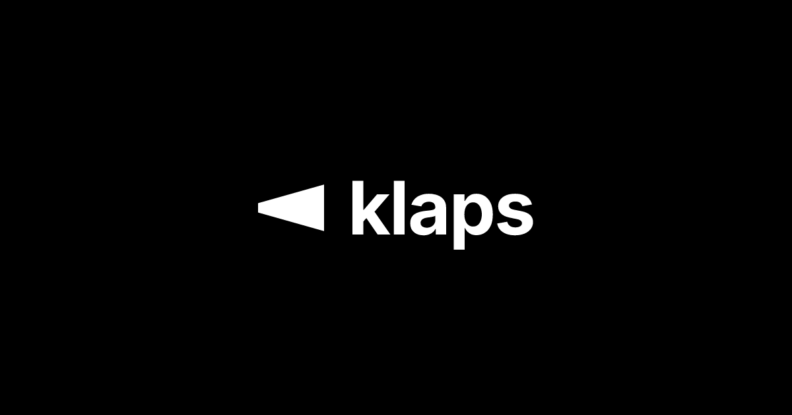

# Klaps

Klaps is a modern movie discovery platform built to help people quickly find great films worth watching.

It makes special screenings, classic cinema, and retrospectives easier to discover in one clear experience.

## What Is Klaps

- A user-first product for finding screenings often missed by mainstream listings.
- A curated and searchable experience focused on relevance, clarity, and speed.
- A connected ecosystem that keeps data fresh and distribution consistent across channels.

## Why It Exists

Finding high-quality screenings often requires too much manual searching across disconnected sources.
Klaps exists to reduce that friction and help people decide what to watch, faster.

## Signature Project

Klaps is my signature project and a long-term product I actively build and maintain.

I lead product direction, architecture, implementation, and continuous improvements across the full ecosystem.

## Ecosystem At A Glance

- `klaps.space` - Frontend application focused on discovery and browsing experience.
- `api.klaps.space` - Backend services and public API powering app data and integrations.
- `klaps.radar` - Automation service for social distribution and audience updates.

## Current Focus

- Improve recommendation quality and discovery relevance.
- Keep screening data accurate, fresh, and dependable.
- Refine UX to make browsing and filtering faster.
- Expand coverage while maintaining product consistency.
- Strengthen reliability, monitoring, and delivery workflows.

## Links

- Live product: [klaps.space](https://klaps.space)
- Creator: [@Biplo12](https://github.com/Biplo12)
- Contact: [kontakt@klaps.space](mailto:kontakt@klaps.space)
